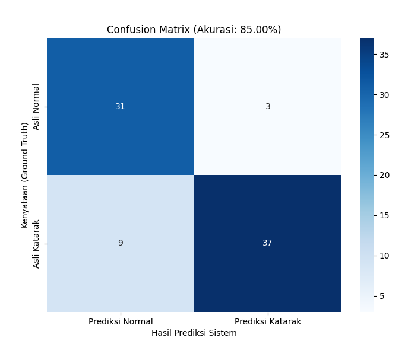
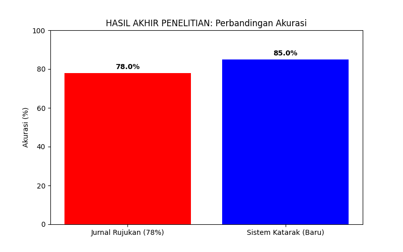

# Deteksi Katarak Berbasis Pengolahan Citra Digital 

Proyek ini bertujuan untuk meningkatkan akurasi deteksi katarak menggunakan analisis tekstur (GLCM) dan augmentasi data, melampaui standar penelitian sebelumnya (78%) menjadi **85%**.

## Fitur Utama
- **Augmentasi Data**: Memperluas dataset dari 100 menjadi 400 citra.
- **Preprocessing**: Histogram Equalization & Canny Edge Detection.
- **Ekstraksi Ciri**: Morfologi (Luas/Keliling) & Tekstur (GLCM).
- **Klasifikasi**: XGBoost Classifier.

## Cara Menjalankan
1. Instal library: `pip install -r requirements.txt`
2. Jalankan seluruh proses: `python main.py`
3. Dimana proses tersebut akan menjalankan program pada file `augmentasi.py`,`ekstraksi_ciri.py` ,`evaluasi_sistem.py`, `pipeline_pcd.py`
4. Folder `dataset_asli` [citra mata] dapat anda gunakan atau tidak (tergantung dari data set yang anda inginkan).
5. `dataset_output` , `dataset_pipeline`, `cm_final_berlabel.png` , `hasil_ekstraksi_ciri.csv` , `hasil_final_jurnal.png` => dihasilkan dari program

## Catatan
- program ini dibuat untuk melakukan pengujian akurasi pada dataset citra yang sudah diambil , jadi ini dibuat pada awalnya melakukan perbandingan pada penelitian terdahulu
- Jika anda melakukan clone , maka anda dapat menghilangkan folder maupun gambar yang saya sebutkan pada nomor `5` serta `image-1.png` dan `image.png`

## Hasil Projek
- Akurasi Sistem: **85.00%**.
  

- Perbandingan Akurasi: Dilihat dari Penelitian terdahulu dengan akurasi yang didapatkan **78.00%** terhadap hasil penelitian **85.00%** , maka dapat disimpulkan penelitian yang dilakukan lebih akurat dalam mendeteksi katarak dengan menggunakan kamera digital. 

